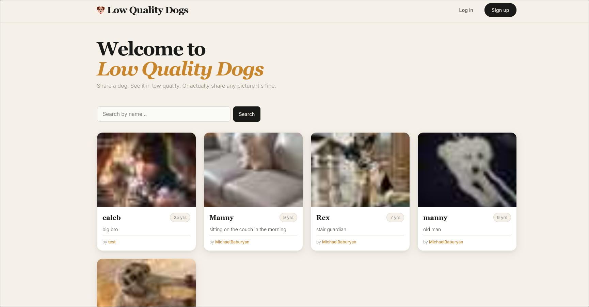
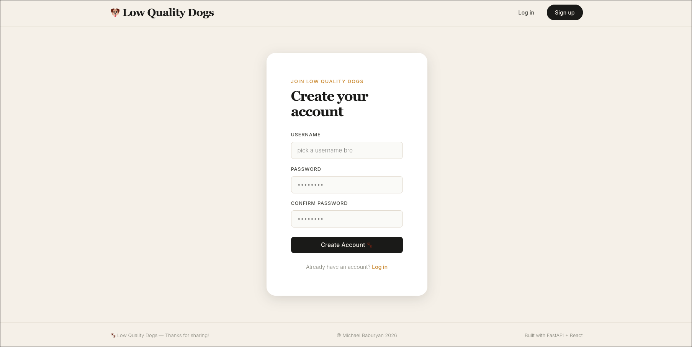

<div align="center">

  <h1>Low Quality Dogs</h1>

  <a href="https://low-quality-dogs.org">
    
  </a>
  
  <p>
    Share your dog with the world in a funny, low quality way!
  </p>
  
  <!-- Badges -->
  
  
  
  

</div>

<!-- Table of Contents -->
## :mag: Table of Contents

- [Project Details](#envelope-project-details)
- [Getting Started Locally](#toolbox-getting-started)
- [Contributions](#whale2-docker-and-automation)
- [License](#warning-license)
- [Contact](#speech_balloon-contact)


<!-- About the Project -->
## :envelope: Project Details

### About Low Quality Dogs

Low quality dogs is a web app made for pet owners to share images of their pets :dog:. Except when you upload an image, it shows up in super low quality. I truly made this becuase I thought it was really 
funny and I had fun making it! The app is made with simplicity and scalability in mind. You only need one account and that's it. No email. No password recovery. Just a simple username and a password. 

### Using the app

To access low quality dogs, click on this url:

:point_right: https://low-quality-dogs.org

Pretty quick right :sunglasses:. You can view everyones uploaded images and search by pet name if your friend uploaded their pet. 



Want to upload your own pets? Make an account! No passwords are saved on the backend nor do I want to know what passwords you use (I know you rotate between three passwords for everything :wink:).



Once you log in, select:

```
+ Upload Dog
```

Fill in the info and pick a file. Boom all done!


<!-- Usage -->
## :toolbox: Getting Started

### Installing Files

Clone the repository and cd into the main directory

```bash
git clone https://github.com/Myan02/Daily-Update.git
cd Daily-Update
```
<br>

**Optional but highly recommend:** create a virtual environment in the app directory

```powershell
# Powershell
python -m venv app\venv
app\venv\Scripts\activate
```

```bash
# Linux/Mac
python -m venv app/venv
source ./app/venv/bin/activate
```
<br>

Install required packages

```bash
pip install -r requirements.txt
```

### Configurations

Environmental variables (**NEVER SHARE OR COMMIT API KEYS TO YOUR REPOSITORY**):
- Rename *.env_template* to *.env*
- Fill in variables with your personal information. E.G. API_URL_BASE_WEATHER=https://api.open-meteo.com/v1/forecast

<br>

Other variables:
- Edit *Daily-Update/app/config.py*
- Update *latitude*, *longitude*, and *timezone* at the bottom of the file with info of your choice

### Run Locally

Run the main.py file!

```bash
cd app
python main.py
```

<!-- Automating with Docker -->
## :whale2: Docker and Automation

### Building with Docker

To containerize the project, make sure you have docker installed on your device. For more support, refer to the official docs: https://docs.docker.com/desktop/.
Cd into the main directory:
```bash
cd Daily-Update
```

Make sure you have a dockerfile, .dockerignore, requirements.txt, and .env file all in the directory. Run docker build:
```bash
docker build -t daily-update:latest .
```

To start the container and run the program, use docker run:
```bash
docker run --rm --env-file .env daily-update:latest
```

*Note:* the container will run and close when the program terminates making it portable and easily managable. 

### Automation

If you have an unused device, like a raspberry pi, you can save the docker image locally and run the container on a schedule using your os's scheduling tools.
There are many scheduling services; I use Cron for Linux machines; Launchd is native to Mac and preferred over Cron; and Task Scheduler on Windows which uses a GUI. 

```bash
# To open crontab in linux
crontab -e
```

```bash
# Add this to your crontab to run the container every day at 9 am and log all errors in cron.log
0 9 * * * docker run --rm --env-file /home/{your home directory}/daily-update/.env daily-update:latest >> /home/{your home directory}/daily-update/cron.log 2>&1
```

## :warning: License

Distributed under the MIT license. Reference LICENSE for more info.

## :speech_balloon: Contact

If you like this project, please contribute. Fork the repo and make it better. Email me if you'd like to share your contributions or ask me anything:
```
Email: baburyanmichael@gmail.com
```

### Thanks for reading :heart:


  
