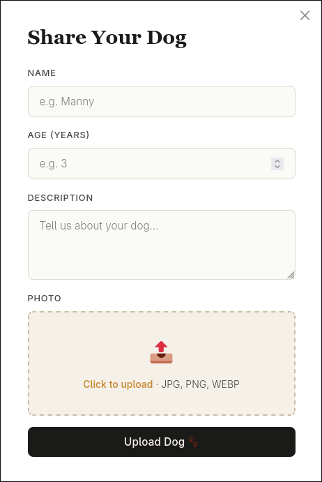

<div align="center">

  <h1>Low Quality Dogs</h1>

  <a href="https://low-quality-dogs.org">
    
  </a>
  
  <p>
    Share your dog with the world in a funny, low quality way!
  </p>
  
  <!-- Badges -->
  
  
  
  

</div>

<!-- Table of Contents -->
## :mag: Table of Contents

- [Project Details](#envelope-project-details)
- [Getting Started Locally](#toolbox-getting-started-locally)
- [Contributions](#desktop_computer-contributions)
- [License](#warning-license)
- [Contact](#speech_balloon-contact)


<!-- About the Project -->
## :envelope: Project Details

### About Low Quality Dogs

Low quality dogs is a web app made for pet owners to share images of their pets :dog:. Except when you upload an image, it shows up in super low quality. I truly made this becuase I thought it was really 
funny and I had fun making it! The app is made with simplicity and scalability in mind. You only need one account and that's it. No email. No password recovery. Just a simple username and a password. 

### Built With


### Using the app

To access low quality dogs, click on this url:

:point_right: https://low-quality-dogs.org :point_left:

Pretty quick right :sunglasses:. You can view everyones uploaded images and search by pet name if your friend uploaded their pet. 


Want to upload your own pets? Make an account! No passwords are saved on the backend nor do I want to know what passwords you use (I know you rotate between three passwords for everything :wink:).


Once you log in, select:

```
+ Upload Dog
```

Fill in the info and pick a file. Boom all done!



To edit or delete your images, click on the edit or delete icons on the dog cards as shown below:

<!-- Add edit and delete image here -->

*Note: Deleting your photos is permenant. I do not save any copies of anything and you will not be able to retrieve it afterwards.*

<!-- Usage -->
## :toolbox: Getting Started Locally

### Forking the Repository

To work on your own version of **Low Quality Dogs**, just fork the repository and start working on it. Keep reading this chapter to find out how to configure your setup.

### Configurations

Environmental variables (**NEVER SHARE OR COMMIT THIS FILE TO YOUR REPOSITORY**):
- In the backend directory, create a .env file
- To configure your env variables, refer to the *config.py* file located in the inner app directory

Some tips to help you with the .env file:
- Keep APP_RELOAD to 1 when testing locally
- I keep IMG_SIZE to 64 but you can set it to whatever you want (I also only allow .png, .jpg, and .webp formats for compression)
- The image and db paths located in the projects root directory, not in the backend directory

### Run Locally

I used *uv* as my preferred python package manager as it is super duper fast. Therefore, there is no requirements.txt file to install your dependencies. I recommend at least trying uv by creating a virtual environment, installing uv with pip, and installing the rest of your app with:

```
uv sync
```

if you have uv installed natively on your machine, make the venv with uv in the backend directory and sync up your dependencies. To run the backend locally, I would suggest simply running the *main.py* file from the backend directory. It will create and initialize all volumes, tables, and the uvicorn web server. To test prod, build the backend with the *build.sh* script to create a docker image of the backend and run the container with *run.sh*.

For the frontend, you only need to have node.js installed along with npm. Run:

```
npm i
```

in the frontend directory to install all dependencies. This app is made with react ts making it really easy to edit components. All routing is handled by an Axios instance and provided through an authentication context to all components. All communication between the frontend and backend is handled by the vite proxy as well as nginx when running in a docker container.

To startup the app with docker containers, run:

```
docker compose up -d --build
```

to build the images and run the services. A *Traefik* image is used to facilitate services.

## :desktop_computer: Contributions

Do you want to make low quality dogs better!?!? Thank you! This project is completely open source so look through the issue tickets and open a pull request. I'll approve and reject as required.

## :warning: License

Distributed under the MIT license. Reference LICENSE for more info.

## :speech_balloon: Contact

If you like this project, please contribute. Fork the repo and make it better. Email me if you'd like to share your contributions or ask me anything:
```
Email: baburyanmichael@gmail.com
```

### Thanks for reading :heart:


  
